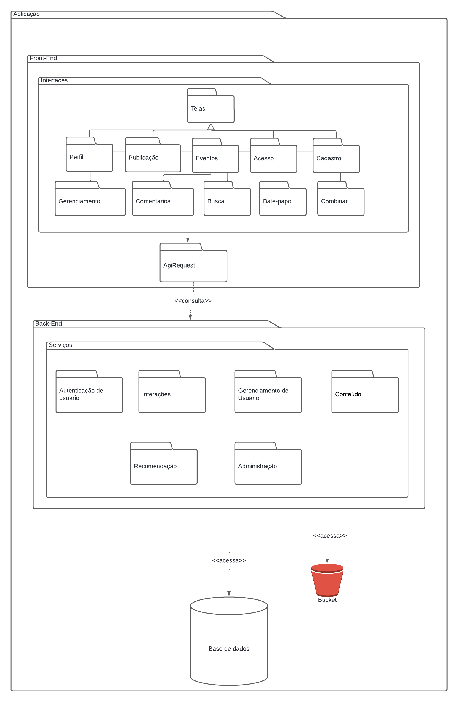

# 4.1. Módulo Estilos e Padrões Arquiteturais

## **4.1.1. DAS**

### **Introdução DAS**

### **Objetivo DAS**

O objetivo do Documento de Arquitetura de Software (DAS) é fornecer uma descrição detalhada da arquitetura de um sistema de software, abrangendo suas principais componentes e interações. Ele serve para comunicar as decisões arquiteturais e fornecer um guia para a implementação e manutenção do sistema

### **Escopo DAS**

O Documento da Arquitetura de Software se aplica ao projeto Unbreja, trabalho da disciplina de Arquitetura e Desenho de Software, no qual possue o objetivo de ser uma ferramenta de interação social entre estudantes atingindo tanto o escopo social quanto o academico.

### **Definições, Acrônimos e Abreviações**

|Abreviação / Acrônimo| Definição (づ￣ 3￣)づ|
|:--|:---|
|GRASP - General Responsibility Assignment Software Patterns|Diretrizes para atribuir responsabilidade a classes e objetos em projeto orientado a objetos|
|GOF - Gang of Four|	Um tipo de padrão de projeto para auxiliar na criação de um software|
|5w2h|What (O que), Why (Por que), Where (Onde), When (Quando), Who (Quem), How (Como) e How much (Quanto)|
|BPMN| Business Process Model and Notation|
|MOSCOW|Must have, Should have, Could have e Will not have|
|UML|Unified Modeling Language|
|DER| Diagrama entidade relacionamento|
|||

### **4.1.1.1 Representação Arquitetural**

#### **Back-End**

Para a implementação do nosso Back-End, utilizamos a linguagem de programação Kotlin. Kotlin é uma linguagem moderna, desenvolvida pela JetBrains, que é totalmente interoperável com Java, permitindo uma transição suave para projetos que já utilizam a plataforma Java. Ela foi projetada para ser concisa, segura e versátil, tornando-a ideal para desenvolvimento de aplicações modernas.

#### **Front-End**

#### **Banco de Dados**

Para o banco de dados, utilizamos o Neo4j, que é um sistema de gerenciamento de banco de dados baseado em grafos. O Neo4j é altamente otimizado para lidar com relações complexas entre dados, permitindo consultas rápidas e eficientes através de sua linguagem de consulta Cypher. Ele é amplamente utilizado em aplicações que exigem modelagem de redes, como redes sociais, recomendação de produtos, e gerenciamento de redes de telecomunicações.

### **4.1.1.2. Metas e Restrições da Arquitetura**

#### **Metas**

|Meta|Descrição ヾ(⌐■_■)ノ♪|
|---|:---|
| Cadastro de usuário                           | Possibilidade de cadastrar novos usuários, incluindo informações, preferências e objetivos. |
| Recomendações de outros usuários para interação | Mecanismo para recomendar perfis com interesses em comum. |
| Match com outros usuários                     | Realizar o match entre perfis com interesses em comum que demonstraram interesse mútuo. |
| Desempenho                                    | As interações não devem apresentar atrasos superiores a 300ms. |
| Suporte Mobile                                | A aplicação deve ser totalmente funcional em dispositivos móveis. |

#### **Restrições**

|Restrição |Descrição (#_<-)|
|---|:---|
| Idade               | A aplicação é voltada para maiores de 18 anos.   |
| Conexão com a rede  | Será necessária conexão com a internet para utilizar o aplicativo. |
| Idioma              | O aplicativo será desenvolvido em português brasileiro. |
| Público             | Foco no público de estudantes da UNB.            |
| Plataforma          | A aplicação será desenvolvida para dispositivos móveis com sistema operacional Android. |
| Prazo Final         | O projeto deve ser concluído até o final da disciplina. |

### **4.1.1.3. Visão Lógica**

A visão lógica da arquitetura de software descreve a estrutura do sistema em termos de pacotes, classes e suas interações, destacando as responsabilidades principais de cada componente e suas relações. Esta visão facilita a compreensão da organização interna do sistema e serve como um guia para a implementação detalhada.

#### **Diagrama de Pacotes**

  <figure>
    <figcaption>Figura 1 - Diagrama de pacotes versão 2</figcaption>
  </figure>

1. **Aplicação**
   - **Componentes:** Front-End, Back-End
   - **Responsabilidade:** Define a estrutura geral da aplicação, separando as responsabilidades entre a interface de usuário e os serviços de back-end.

2. **Front-End**
   - **Componentes:** Telas, ApiRequest
   - **Responsabilidade:** Gerencia a interface do usuário e as requisições para o back-end.

3. **Back-End**
   - **Componentes:** Autenticação de usuário, Interações, Gerenciamento de Usuário, Conteúdo, Recomendação, Administração
   - **Responsabilidade:** Implementa os serviços que suportam a funcionalidade da aplicação, incluindo autenticação, gerenciamento de conteúdo e recomendações.

#### **Diagrama de Classes**

Figura 2: Diagrama de Classes. Fonte: Ana Letícia e Artur Seppa, 2024.

1. **Usuário**
   - **Atributos:** nomeUsuario, nomeCompleto, email, senha, dtNascimento, telefone, objetivo, descricao, redeSocial, universidade, foto, interesse
   - **Métodos:** cadastrar(), deletar(), atualizar(), ler()
   - **Responsabilidade:** Representa os usuários do sistema e gerencia suas informações e interações.

2. **Administrador**
   - **Atributos:** perfil
   - **Métodos:** cadastrar(), deletar(), atualizar(), ler()
   - **Responsabilidade:** Gerencia a administração do sistema.

3. **Chat**
   - **Atributos:** mensagem
   - **Métodos:** criar(), ler()
   - **Responsabilidade:** Representa a funcionalidade de troca de mensagens entre usuários.

4. **Match**
   - **Atributos:** usuario1, usuario2, chat
   - **Métodos:** criar(), deletar(), ler()
   - **Responsabilidade:** Gerencia as correspondências entre usuários (matches).

5. **Foto**
   - **Atributos:** data, horario, arquivo
   - **Métodos:** apagar(), inserir(), ler()
   - **Responsabilidade:** Gerencia as fotos carregadas pelos usuários.

6. **Evento**
   - **Atributos:** data, horario, descricao, foto
   - **Métodos:** criarPublicacao(), exibirDetalhes()
   - **Responsabilidade:** Gerencia os eventos criados e publicados.

7. **Universidade**
   - **Atributos:** sigla, campus
   - **Métodos:** apagar(), atualizar(), inserir(), ler()
   - **Responsabilidade:** Representa e gerencia as universidades associadas aos usuários.

8. **Interesse**
   - **Atributos:** nome, descricao
   - **Métodos:** apagar(), atualizar(), inserir(), ler()
   - **Responsabilidade:** Gerencia os interesses dos usuários.

#### **Diagrama de Componentes**

Figura 3: Diagrama de componentes. Fonte: Pablo Guilherme e Suzane Duarte, Grupo 8, 2024

1. **Interfaces**

   - **Telas**
     - **Componentes:** Perfil, Publicação, Eventos, Acesso, Cadastro, Gerenciamento, Comentários, Busca, Bate-papo, Combinar
     - **Responsabilidade:** Define a interface de usuário, fornecendo telas e componentes para interação.

2. **Back-End**
   - **Serviços**
     - **Componentes:** Autenticação de usuário, Interações, Gerenciamento de Usuário, Conteúdo, Recomendação, Administração
     - **Responsabilidade:** Implementa a lógica de negócio e fornece serviços essenciais para a operação do sistema.

- **Usuário** se relaciona com **Chat**, **Match**, **Foto**, **Interesse** e **Universidade** para gerenciar informações pessoais e interações.
- **Administrador** gerencia as funcionalidades administrativas através do componente **Administração** no back-end.
- **Telas** no front-end se comunicam com **ApiRequest** para fazer requisições aos serviços no back-end.
- **Serviços** no back-end, como **Autenticação de usuário** e **Gerenciamento de Usuário**, suportam as operações realizadas pelos usuários no front-end.
- **Banco de Dados** e **Bucket** são acessados pelos serviços do back-end para armazenamento e recuperação de dados.

### **4.1.1.4. Visão de Implementação**

- 4.1.1.5.1 Introdução
- 4.1.1.5.2 Diagrama de Componentes

### **4.1.1.5. Visão de Implantação**

- 4.1.1.6.1 Introdução
- 4.1.1.6.2 Diagrama de Contexto
- 4.1.1.6.3 Diagrama de Implantação

### **4.1.1.6. Visão de Dados**

Esta é uma visão geral de dados persistentes, o qual mapeia dos objetos aos dados persistentes. Trata-se, basicamente, de uma visão do modelo de dados, visualizada com diagramas de classe, os quais são usados para descrever especificamente esse modelo de dados. Para isso o grupo utilizou da linguagem de dados relacionais MySQL, diagrama entidade relacionamento (DER) e modelo relacional

#### **Dicionário de Dados**

Um dicionário de dados é um documento ou recurso que fornece informações detalhadas sobre os dados dentro de um sistema de informações, banco de dados ou conjunto de dados. Esse documento é uma referência fundamental para desenvolvedores, administradores de banco de dados, analistas de dados e outros profissionais que trabalham com dados no contexto de um sistema.
Abaixo temos o dicionário de dados para o contexto de estudo de avaliação de produto.

#### **Exemplo Dicionário de Dados**

| Entidade: Exemplo                                             |
| --------------------------------------------------------------- |
| *Descrição:* Tabela que armazena informações sobre exemplo. |

 

| *Atributo* | *Propriedades do Atributo*           | *Tamanho* | *Descrição*                  |
| ------------ | -------------------------------------- | ----------- | ------------------------------ |
|         |   |         |  |

Tabela 1: Entidade Exemplo Autor: [Ana Letícia](https://github.com/analeticiaa).

#### **4.1.1.6.1 Diagrama Entidade Relacionamento (DER)**

Um Diagrama Entidade-Relacionamento (DER) é uma representação gráfica que descreve a estrutura lógica de um banco de dados. Ele ilustra as entidades, seus atributos, e os relacionamentos entre essas entidades. O DER é utilizado para modelar e visualizar a forma como os dados serão organizados e interconectados, servindo como uma ferramenta essencial na fase de planejamento e design de bancos de dados relacionais.

Figura 1: Diagrama Entidade Relacionamento. Autor: [Ana Letícia](https://github.com/analeticiaa).

#### **4.1.1.6.2 Modelo Relacional (MRel)**

O Modelo relacional apresenta uma possível implementação lógica do DER. Para construção desse diagrama foi usado o software [brModelo](http://www.sis4.com/brModelo/), você pode ter acesso ao [arquivo compatível com o software aqui.](https://raw.githubusercontent.com/UnBArqDsw2023-2/2023.2_G8_ProjetoMagazineLuiza/main/docs/Assets/ArquiteturaReutilizacao/VisaoDados/Modelo_Relacionao_magazineluiza.brM3")

Figura 1: Diagrama Entidade Relacionamento. Fonte: Luana 
Torres e Ana Letícia, Grupo 8, 2024

#### **4.1.1.7.4 Colocando em Prática**

##### **Script Físico**

##### **Script Popula**

##### **Script Apaga**

##### **Script Consulta**

##### **Script Papéis**

### **4.1.1.8. Tamanho e Performance**

### **4.1.1.9. Qualidade**

## **5. Referências**

> SERRANO, Milene. AULA - ARQUITETURA & DAS – PARTE II. Disponível em: <https://aprender3.unb.br/pluginfile.php/2649469/mod_label/intro/Arquitetura%20e%20Desenho%20de%20Software%20-%20Aula%20Arquitetura%20e%20DAS%20-%20Parte%20II%20-%20Profa.%20Milene.pdf>. Acesso em: 25 Novembro de 2023.

> MYSQL: MySQL. Disponível em: <https://www.mysql.com>. Acesso em: 25, Novembro de 2023.

> brModelo: SIS4. brModelo, 2020. Disponível em: <http://www.sis4.com/brModelo/>. Acesso em: 25, Novembro de 2025.

> Conceito: Visão da Implementação. Disponível em: <https://www.cin.ufpe.br/~gta/rup-vc/core.base_rup/guidances/concepts/implementation_view_E373E3B6.html>. Acesso em: 27 nov. 2023.

> BUSCHMANN, F. et al. Pattern-oriented software architecture. Chichester: Wiley, 1996.

> SERRANO, Milene. Diretrizes Organização dos Projetos. Disponível em: <https://aprender3.unb.br/course/view.php?id=19535>. Acesso em: 29 set. de 2023.

## **6. Histórico de versões**

| Data       | Versão | Descrição                                                   | Autor(a)                                              | Revisor(a)                                         |
| :--------: | :----: | :---------------------------------------------------------: | :---------------------------------------------------: | :------------------------------------------------: |
| 08/07/2024 | 1.0    | Criação do documento             | [Pablo Guilherme](https://github.com/PabloGJBS) e [João Pedro](https://github.com/jpanacleto2) | [Ana Letícia](https://github.com/analeticiaa) |
| 08/08/2024 |  1.1   | Criação da parte de visão de dados |                         [Ana Letícia](https://github.com/analeticiaa)                          |        [Pablo Guilherme](https://github.com/PabloGJBS)          |
| 09/08/2024 |  1.2   | Primeira versão do Diagrama Entidade Relacionamento |                     [Luana Torres](https://github.com/luanatorress) e [Ana Letícia](https://github.com/analeticiaa)                          |            [Pablo Guilherme](https://github.com/PabloGJBS)                 |
| 10/08/2024 |  1.3   | Correção na formatação do projeto  |                    [Pablo Guilherme](https://github.com/PabloGJBS) e  [Ana Letícia](https://github.com/analeticiaa)                       |  [Suzane Duarte](https://github.com/suzaneduarte)                            |

