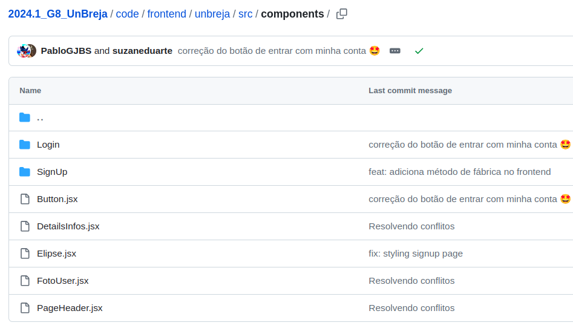
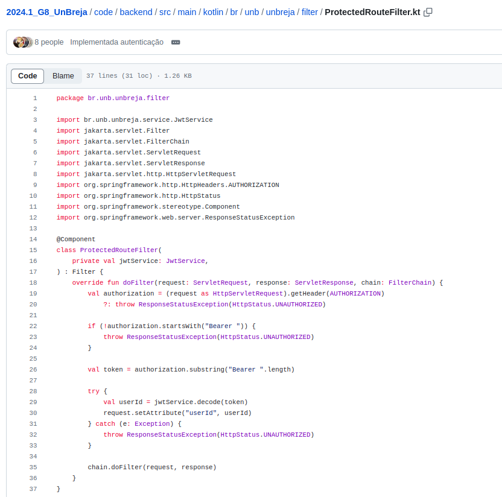
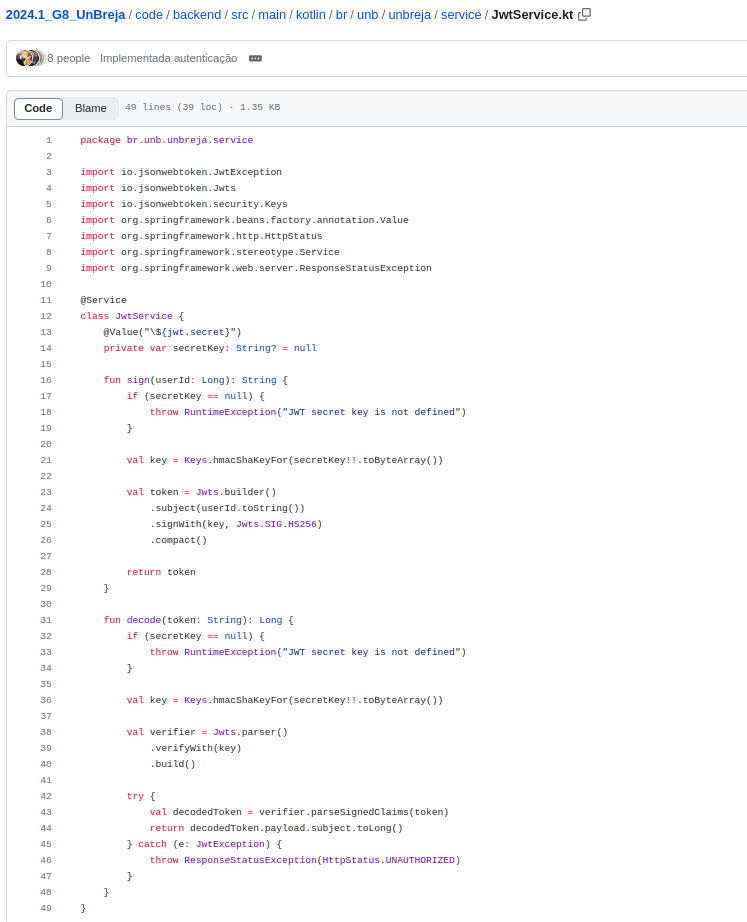

# Módulo Reutilização de Software

## 1. Introdução

O conteúdo discutido neste módulo será sobre Reutilização de Software, buscando evidenciar a parte conceitual e código aplicada ao escopo da aplicação desenvolvida para o Projeto UnBreja idealizada durante a disciplina Arquitetura de Software. 

A reutilização de software trata de utilizar informações, componentes ou sistemas de software já existentes para ajudar no desenvolvimento de novos sistemas. Dessa forma, este documento visa destacar exemplos e práticas onde tais abordagens foram aplicadas efetivamente no projeto. 


## 2. Metodologia

A priori foi elaborada uma divisão da equipe para que todos consigam discutir, elaborar, desenvolver e revisar diferentes partes do documento. 

Dessa forma, foram definidas duas frentes principais: 

1. Módulo Estilos e Padrões Arquiteturais

- DAS Visão Lógica: [João Pedro Anacleto](https://github.com/jpanacleto2) e [Pablo Guilherme](https://github.com/PabloGJBS) 

- DAS outra visão (Visão de Dados): [Ana Letícia](https://github.com/analeticiaa) e [Luana Torres](https://github.com/luanatorress) 

2. Módulo Reutilização de Software

- Frontend: [Edilberto Cantuaria](https://github.com/edilbertocantuaria), [Matheus Silverio](https://github.com/MattSilverio), [Suzane Duarte](https://github.com/suzaneduarte) e [Augusto Duarte](https://github.com/Augcamp)

- Backend: [Eduardo Rodrigues](https://github.com/Eduardo-RFarias), [Cleber Brant](https://github.com/CleberBrant), [Wesley Lira](https://github.com/Weslin-0101)  e [Artur Seppa](https://github.com/artur-seppa)


## 3. Reutilização de código no Front-End 

### Caso 1 - Utilização do Factory Method 

O Factory Method é um padrão de projeto criacional que fornece uma interface para criar objetos em uma superclasse, mas permite que as subclasses alterem o tipo de objetos que serão criados. Ele é útil quando o código precisa trabalhar com objetos que podem ser de diferentes tipos, mas que compartilham uma interface ou classe base comum.

No contexto do projto, foi criado o componente `Button`, de forma que através do Factory Method poderemos reutilizar esse componente na aplicação em diferentes contextos a depender das necessidades da aplicação. A ideia é que, ao invés de instanciar diretamente um botão específico, um método de fábrica seja utilizado para gerar o botão correto com base em determinados critérios ou parâmetros.


2. Módulo Reutilização de Software

- Frontend: [Edilberto Cantuaria](https://github.com/edilbertocantuaria), [Matheus Silverio](https://github.com/MattSilverio), [Suzane Duarte](https://github.com/suzaneduarte) e [Augusto Duarte](https://github.com/Augcamp)

- Backend: [Eduardo Rodrigues](https://github.com/Eduardo-RFarias), [Cleber Brant](https://github.com/CleberBrant), [Wesley Lira](https://github.com/Weslin-0101)  e [Artur Seppa](https://github.com/artur-seppa)


## 3. Reutilização de código

### Utilização do Factory Method 

O Factory Method é um padrão de projeto criacional que fornece uma interface para criar objetos em uma superclasse, mas permite que as subclasses alterem o tipo de objetos que serão criados. Ele é útil quando o código precisa trabalhar com objetos que podem ser de diferentes tipos, mas que compartilham uma interface ou classe base comum.

No React Native, os componentes desempenham um papel vital na construção de interfaces de usuário. Eles encapsulam a lógica e a aparência de uma parte específica da IU. O Factory Method pode ser aproveitado para criar componentes dinamicamente com base em certas condições ou configurações.

No contexto do projeto, foi criado o componente `Button`, o qual é reutilizado em diferentes contextos. Como por exemplo, na tela de Cadastro em que ele é utilizado tanto no Botão "Cadastrar", quanto no Botão de "Entrar com minha conta" conforme visualizado na imagem abaixo. 


Dessa forma, através do Factory Method poderemos reutilizar esse componente em diferentes contextos a depender das necessidades da aplicação. A ideia é que, ao invés de instanciar diretamente um botão específico, um método de fábrica seja utilizado para gerar o botão correto com base em determinados critérios ou parâmetros.

A partir disso, foi criado em `2024.1_G8_UnBreja/code/frontend/unbreja/src/components/Button.jsx` o Método de Fábrica `createButton` conforme pode ser visto no trecho de código abaixo, o qual foi implementado no arquivo mencionado. 

```typescript
const ButtonComponent = ({ className, children, ...props }) => (
  <Link className={className} {...props}>
    {children}
  </Link>
);

const PrimaryButton = styled(ButtonComponent)`
  background-color: #aa1945;
  color: #ffffff;
  font-weight: medium;
  font-size: 16px;
  font-family: "Inter", sans-serif;
  width: 355px;
  height: 52px;
  border-radius: 15px;
  margin-top: auto;
  margin-bottom: 35px;
  display: flex;
  justify-content: center;
  align-items: center;
  cursor: pointer;
  text-align: center;
  &:hover {
    background-color: #d74773;
  }
`;

const SecondaryButton = styled(ButtonComponent)`
  background-color: white;
  color: #aa1945; 
  border: 2px solid #aa1945; 
  &:hover {
    background-color: #f8f8f8;
  }
`;

export function createButton(type, to, children) {
  if (type === 'primary') {
    return <PrimaryButton to={to}>{children}</PrimaryButton>;
  } else if (type === 'secondary') {
    return <SecondaryButton to={to}>{children}</SecondaryButton>;
  } else {
    throw new Error("Tipo de botão desconhecido");
  }
}
```

Esta função de fábrica decide qual componente de botão deve ser criado com base no parâmetro type. Assim, ela encapsula a lógica de criação e estilo do botão, facilitando a manutenção e expansão futura.

Além disso, ao invés de utilizar diretamente o componente Button, é utilizada a função `createButton`, que é mais flexível e segue o padrão Factory Method, conforme consta a seguir no arquivo `2024.1_G8_UnBreja/code/frontend/unbreja/src/components/SignUp/SignUpForm.jsx`.

```
function SignUpForm() {
  return (
    <div>
      <Input />
      <div className="terms-container">
        <input type="checkbox" id="terms" />
        <label htmlFor="terms">Eu li e concordo com os termos de uso</label>
      </div>
      <ButtonWrapper>
        {createButton('primary', '/cadastrar', 'Cadastrar')}
        <TextWrapper>
          <p>Já possui conta?</p>
          {createButton('secondary', '/login', 'Entrar com minha conta')}
        </TextWrapper>
      </ButtonWrapper>
    </div>
  );
}
```

### Estratégia de Componentização

A reutilização de código é uma prática essencial para garantir a eficiência e a escalabilidade de aplicações. A estratégia de componentização adotada pela equipe, a qual envolve a criação de componentes reutilizáveis, nos permite que um único componente possa ser definido uma vez e utilizado em múltiplos locais dentro da aplicação, o que reduz a redundância e facilita a manutenção do código. 

Em React Native, componentes são unidades autônomas que encapsulam a lógica e a aparência de partes específicas da interface do usuário, permitindo que os desenvolvedores criem interfaces modulares e flexíveis, onde cada componente pode ser desenvolvido e testado de forma isolada. Assim, essa modularidade não só melhora a organização do código, mas também promove a reutilização. 

A título de exemplo, o componente `Button` mencionado anteriormente pode ser criado com diferentes variantes de estilo, conforme inclusive foi realizando criando a variação primária e secundária, e que estão sendo reutilizados em diversas partes da aplicação. Além desse componente, vários outros, como o `Elipse`, também foram criados com o objetivo de facilitar sua utilização em diferentes contextos conforme imagem abaixo: 



Dessa forma, a estratégia de componentização adotada contribui para um código mais limpo, modular e fácil de manter, alinhado com as melhores práticas de desenvolvimento front-end.

### JWT

No projeto, foi utilizado o JWT (JSON Web Tokens) para validação de tokens através de middleware Express, a qual é uma abordagem eficiente para autenticação e autorização de usuários. 

Essa técnica não só reforça a segurança, mas também promove a reutilização de código ao centralizar a lógica de autenticação em um único middleware, que pode ser aplicado em diversas rotas da aplicação e que pode ser encontrada através da lógica desenvolvida nos seguintes arquivos: 





Além disso, essa modelagem facilita a manutenção e expansão do sistema, uma vez que qualquer alteração na validação do token pode ser feita em um único lugar, refletindo em toda a aplicação de forma consistente.

### Utilização do Decorator 

No arquivo `code/backend/src/main/kotlin/br/unb/unbreja/model/Usuario.kt` e conforme pode ser visto no código a seguir, são utilizadas diversas anotações como @Entity, @Id, @Column, @ManyToMany, @JoinTable, entre outras. 

```
package br.unb.unbreja.model

import jakarta.persistence.*
import java.util.*

@Entity
open class Usuario(
    @Id
    @GeneratedValue(strategy = GenerationType.IDENTITY)
    open var id: Long? = null,

    @Column(unique = true, nullable = false, length = 254)
    open var email: String,

    @Column(nullable = false, length = 100)
    open var nomeCompleto: String,

    @Column(nullable = true, length = 300)
    open var descricao: String?,

    @Column(nullable = false, length = 100)
    open var senha: String,

    @Column(nullable = false)
    open var dtNascimento: Date,

    @Column(length = 255)
    open var fotoUsuario: String? = null,

    @Column(nullable = false)
    open var isAdmin: Boolean = false,

    @ManyToMany(fetch = FetchType.LAZY, cascade = [CascadeType.MERGE, CascadeType.PERSIST])
    @JoinTable(
        name = "interesse_usuarios",
        joinColumns = [JoinColumn(name = "usuarios_id")],
        inverseJoinColumns = [JoinColumn(name = "interesse_nome")]
    )
    open var interesses: MutableSet<Interesse> = mutableSetOf(),

    @ManyToOne(fetch = FetchType.EAGER, cascade = [CascadeType.ALL])
    @JoinColumn(name = "universidade_id", nullable = false)
    open var universidade: Universidade,

    @ManyToMany(fetch = FetchType.LAZY, cascade = [CascadeType.MERGE, CascadeType.PERSIST])
    @JoinTable(
        name = "match_usuarios",
        joinColumns = [JoinColumn(name = "usuario_origem_id")],
        inverseJoinColumns = [JoinColumn(name = "usuario_destino_id")]
    )
    open var matches: MutableSet<Usuario> = mutableSetOf(),
)
```

Essas anotações são uma forma de decoração no sentido de que elas adicionam metadados às classes e aos campos, informando ao framework de persistência como esses elementos devem ser mapeados para o banco de dados.

O padrão de projeto Decorator permite que se adicione comportamento adicional a um objeto dinamicamente, sem alterar o código da classe base. Ele é útil quando você deseja evitar a criação de subclasses excessivas e quer adicionar funcionalidades de forma modular.

Aplicar o conceito de Decorator no contexto do JPA significa que as anotações decoram a classe e seus atributos com comportamentos específicos, como a forma como os dados são armazenados no banco de dados ou a maneira como as relações entre entidades são gerenciadas. Por exemplo, @Id e @GeneratedValue decoram o campo id para que ele seja identificado como a chave primária e que seu valor seja gerado automaticamente.

Tais anotações atuam como decoradores ao definir comportamentos específicos para a persistência dos dados, sem a necessidade de alterar a lógica principal da classe Usuario. Com isso, o uso de anotações como essas permite que a lógica de persistência seja modular, clara e extensível, facilitando a manutenção e a evolução do código ao longo do tempo.

### Utilização do Chain of Responsibility  

O Chain of Responsibility é um padrão comportamental que permite que uma solicitação passe por uma cadeia de handlers (manipuladores) até que um deles a processe. Cada handler na cadeia decide se processa a solicitação ou se a passa para o próximo handler na sequência. Esse padrão é útil quando se deseja desacoplar o remetente da solicitação dos seus destinatários, permitindo que múltiplos handlers possam interagir com a solicitação de maneira organizada.

No contexto do código conforme pode ser visto em `code/backend/src/main/kotlin/br/unb/unbreja/filter/ProtectedRouteFilter.kt` e no cósigo apresentado a seguir, o método doFilter da classe ProtectedRouteFilter atua como um dos handlers na cadeia de responsabilidade. O FilterChain é a implementação da cadeia em si, que contém vários filtros que serão processados sequencialmente. A responsabilidade do ProtectedRouteFilter é verificar se o cabeçalho Authorization está presente e se segue o formato esperado ("Bearer <token>"). Caso contrário, ele lança uma exceção para bloquear o acesso à rota protegida.

```
package br.unb.unbreja.filter

import br.unb.unbreja.service.JwtService
import jakarta.servlet.Filter
import jakarta.servlet.FilterChain
import jakarta.servlet.ServletRequest
import jakarta.servlet.ServletResponse
import jakarta.servlet.http.HttpServletRequest
import org.springframework.http.HttpHeaders.AUTHORIZATION
import org.springframework.http.HttpStatus
import org.springframework.stereotype.Component
import org.springframework.web.server.ResponseStatusException

@Component
class ProtectedRouteFilter(
    private val jwtService: JwtService,
) : Filter {
    override fun doFilter(request: ServletRequest, response: ServletResponse, chain: FilterChain) {
        val authorization = (request as HttpServletRequest).getHeader(AUTHORIZATION)
            ?: throw ResponseStatusException(HttpStatus.UNAUTHORIZED)

        if (!authorization.startsWith("Bearer ")) {
            throw ResponseStatusException(HttpStatus.UNAUTHORIZED)
        }

        val token = authorization.substring("Bearer ".length)

        try {
            val payload = jwtService.decode(token)
            request.setAttribute("userId", payload.userId)
            request.setAttribute("isAdmin", payload.isAdmin)
        } catch (e: Exception) {
            throw ResponseStatusException(HttpStatus.UNAUTHORIZED)
        }

        chain.doFilter(request, response)
    }
}
```

Se o token JWT for válido e a verificação bem-sucedida, o filtro extrai as informações do token (como userId e isAdmin) e as anexa ao request, permitindo que os próximos handlers na cadeia (ou o próprio endpoint da rota) possam utilizar essas informações. Finalmente, o método chain.doFilter(request, response) passa a solicitação para o próximo filtro na cadeia, continuando o processo de tratamento.

Essa implementação do Chain of Responsibility facilita a separação de responsabilidades, uma vez que cada filtro na cadeia se concentra em uma tarefa específica (neste caso, a autenticação JWT). Além disso, permite que novos filtros sejam adicionados ou removidos sem afetar o funcionamento dos outros, promovendo a flexibilidade e a extensibilidade do sistema.

## 6. Conclusão

A reutilização de software demonstrada no módulo é uma prática fundamental que não apenas aprimora a eficiência do desenvolvimento, mas também contribui para a manutenção e escalabilidade de sistemas como o Projeto UnBreja. Através da adoção de padrões de projeto como o Factory Method, a equipe conseguiu criar componentes flexíveis e reutilizáveis, exemplificados pelo componente Button, e que pode ser aplicado em diferentes contextos com facilidade. Essa abordagem não só reduz a redundância no código, mas também facilita a manutenção e futuras expansões da aplicação.

Já a estratégia de componentização utilizada pela equipe no desenvolvimento do front-end, reforça ainda mais a importância da reutilização de código. Componentes como Button e Elipse, que foram desenvolvidos com modularidade em mente, garantem que o código seja organizado, limpo e fácil de manter. Além disso, esses componentes são testáveis de forma isolada, o que melhora a qualidade do software e facilita a implementação de novas funcionalidades sem comprometer partes já desenvolvidas da aplicação.

Por fim, a utilização do JWT para validação de tokens exemplifica como a centralização da lógica de autenticação em um middleware contribui para a segurança e reutilização do código. Ao implementar essa técnica, a equipe não apenas garante que a aplicação seja segura, mas também simplifica a manutenção, uma vez que qualquer alteração na lógica de autenticação se propaga automaticamente por todas as rotas protegidas. 

Em suma, essas práticas demonstram que a equipe conseguiu concluir com o compromisso de utilizar as melhores práticas de desenvolvimento e modelagem de software, resultando em uma aplicação robusta e escalável.

## Referências

> GAMMA, Erich; HELM, Richard; JOHNSON, Ralph; VLISSIDES, John. Design Patterns: Elements of Reusable Object-Oriented Software. Boston: Addison-Wesley, 1994. Disponível em: <https://www.javier8a.com/itc/bd1/articulo.pdf>. Acesso em: 23 jul. de 2024.

> Projeto Donact, Grupo 2, 2022.1. GitHub.[https://unbarqdsw2022-1.github.io/2022.1_G2_DonAct/#/](https://unbarqdsw2022-1.github.io/2022.1_G2_DonAct/#/)

> JWT.io. Introduction to JSON Web Tokens. Disponível em: https://jwt.io/introduction. Acesso em: 16 ago. 2024.

> GOMES, Cristiano. React Native: Componentização. Medium, 2019. Disponível em: https://medium.com/datainfo/react-native-componentiza%C3%A7%C3%A3o-fea0096d7e57. Acesso em: 16 ago. 2024.

> SAMMAN, Kashif. Scalable React Native Apps with the Factory Method Pattern. Medium, 2020. Disponível em: https://medium.com/@mr.kashif.samman/scalable-react-native-apps-with-the-factory-method-pattern-2ffe15f3a3e2. Acesso em: 16 ago. 2024.

## Controle de Versionamento

| Versão | Data da alteração |      Alteração      |     Responsável     |                     Revisor                      | Data de revisão |
| :----: | :---------------: | :-----------------: | :-----------------: | :----------------------------------------------: | :-------------: |
|  1.0   |    12/08/2024     | Criação do template e adicionando introdução e metodologia do artefato | [Suzane Duarte](https://github.com/suzaneduarte) | [Eduardo Rodrigues](https://github.com/Eduardo-RFarias) |  12/08/2024     |
|  1.1   |    15/08/2024     | Adicionando Reutilização de código utilizando Factory Method | [Suzane Duarte](https://github.com/suzaneduarte) | [João Pedro Anacleto](https://github.com/jpanacleto2) |  15/08/2024   |
|  1.2   |    16/08/2024     | Adicionando Reutilização de código utilizando componentização | [Suzane Duarte](https://github.com/suzaneduarte) | [Edilberto Cantuaria](https://github.com/edilbertocantuaria) |  16/08/2024   |
|  1.3   |    16/08/2024     | Adicionando Reutilização de código utilizando JWT | [Suzane Duarte](https://github.com/suzaneduarte) | [Pablo Guilherme](https://github.com/PabloGJBS)  |  16/08/2024   |
|  1.4   |    16/08/2024     | Adicionando Reutilização de código utilizando Decorator | [Suzane Duarte](https://github.com/suzaneduarte) | [Eduardo Rodrigues](https://github.com/Eduardo-RFarias)  |  16/08/2024   |
|  1.5   |    16/08/2024     | Adicionando Reutilização de código utilizando Chain | [Suzane Duarte](https://github.com/suzaneduarte) | [Eduardo Rodrigues](https://github.com/Eduardo-RFarias)  |  16/08/2024   |