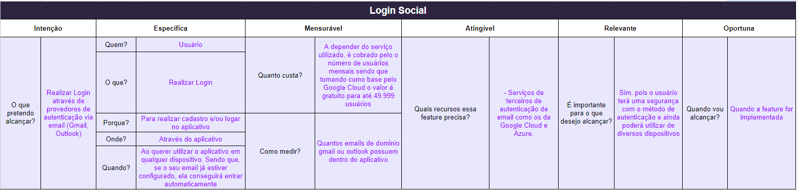
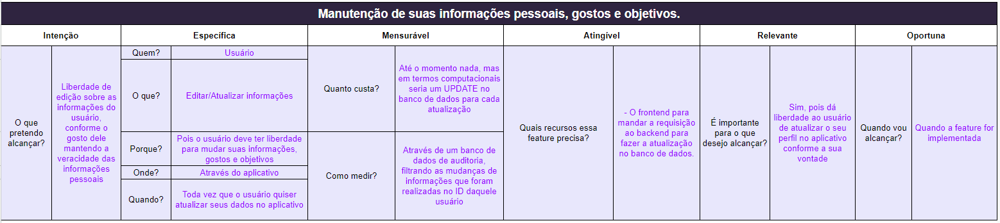
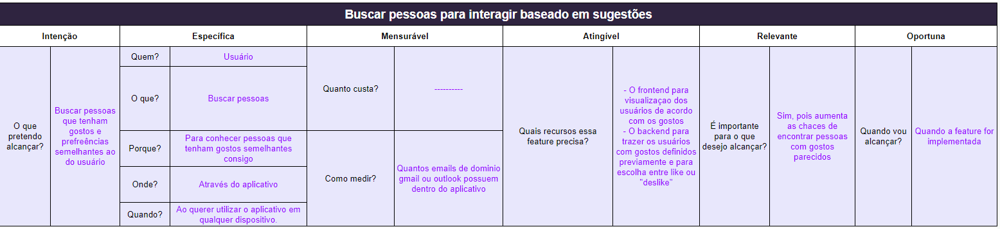
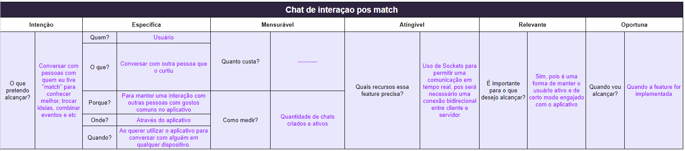
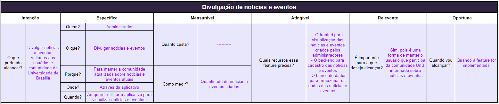

# 5W2H

## 1. Introdução

No desenvolvimento de aplicativos de software, é crucial ter uma estratégia sólida para definir e implementar funcionalidades de forma eficaz. Duas metodologias amplamente utilizadas para esse fim são o 5W2H e o método SMART. O 5W2H, baseado em sete perguntas simples - What (O que), Why (Por que), Where (Onde), When (Quando), Who (Quem), How (Como) e How much (Quanto) - fornece uma estrutura abrangente para identificar e entender os requisitos do projeto. Por outro lado, o método SMART, que define objetivos específicos, mensuráveis, alcançáveis, relevantes e com prazos determinados, ajuda a garantir que as funcionalidades definidas estejam alinhadas com as metas do projeto e sejam viáveis em termos de implementação e resultado final. 

## 2. Metodologias e elementos

Neste contexto, a combinação do 5W2H com a metodologia SMART oferece uma abordagem abrangente e estruturada para definir as funcionalidades de um aplicativo de software, e isso nos ajudou bastante e definir nosso 5W2H requintado com o metodo SMART, onde conseguimos entender muito melhor cada funcionalidade pensada por nossa equipe na reunião de definição dos requisitos. O aluno Matheus Silverio já havia alguma experiência com o metodo SMART e isso nos ajudou bastante no desenvolvimento do documento inicial e depois melhoramos ele e fizemos completo com metodologia SMART, onde os alunos Cleber Brant e Matheus Silverio entraram em reunião para denifição dos conceitos aprendidos nas fontes citadas, mas, buscamos mais informações em alguns sites(estão nas referências) e agora conseguimos analisar cada uma dessas metodologias e seus elementos para entender como podem ser aplicados de forma eficaz:

### 2.1. 5W2H:

O 5W2H, composto por sete perguntas simples - What (O que), Why (Por que), Where (Onde), When (Quando), Who (Quem), How (Como) e How much (Quanto), proporciona uma estrutura detalhada para identificar e entender os requisitos do projeto.

- O que (What): Refere-se à descrição das funcionalidades específicas que o aplicativo deve ter. Isso envolve a definição clara e concisa das tarefas que o aplicativo realizará para atender às necessidades dos usuários.

-  Por que (Why): Essa pergunta busca compreender os motivos por trás de cada funcionalidade proposta. É importante entender os objetivos e benefícios esperados ao implementar determinada funcionalidade.

- Onde (Where): Determina o contexto ou localização em que cada funcionalidade será utilizada. Isso pode incluir diferentes dispositivos, ambientes ou cenários de uso do aplicativo.

- Quando (When): Define o momento ou a frequência em que cada funcionalidade será acionada ou estará disponível para os usuários. Isso ajuda a planejar a sequência de desenvolvimento e priorização das funcionalidades.

- Quem (Who): Identifica os responsáveis por cada funcionalidade, incluindo os desenvolvedores, os usuários finais e outras partes interessadas. Isso facilita a atribuição de tarefas e a comunicação eficaz entre os envolvidos no projeto.

- Como (How): Descreve a forma como cada funcionalidade será implementada e executada no aplicativo. Isso inclui os recursos necessários, as tecnologias a serem utilizadas e os processos de desenvolvimento envolvidos.

- Quanto (How much): Refere-se aos recursos financeiros, temporais e humanos necessários para implementar cada funcionalidade. Isso ajuda a estimar os custos e o esforço envolvido em todo o projeto.

### 2.2. Metodologia SMART:

O método SMART é uma abordagem para definir objetivos que sejam Específicos, Mensuráveis, Atingíveis, Relevantes e com Tempo Determinado. Quando aplicado à definição de funcionalidades de um aplicativo de software, ajuda a garantir que cada elemento seja claramente compreendido, mensurável e contribua significativamente para o sucesso do projeto.

- Específico (Specific): Cada funcionalidade deve ser descrita de forma clara e precisa, sem ambiguidades. Isso ajuda a evitar interpretações divergentes e garante que todos os envolvidos entendam o que precisa ser feito.

- Mensurável (Measurable): As funcionalidades devem ser formuladas de maneira que seu progresso e sucesso possam ser medidos objetivamente. Isso permite acompanhar o desempenho do projeto e avaliar se os objetivos estão sendo alcançados.

- Atingível (Achievable): É importante que as funcionalidades sejam realistas e viáveis dentro das restrições do projeto, incluindo recursos financeiros, tecnológicos e humanos disponíveis.

- Relevante (Relevant): Cada funcionalidade deve estar alinhada com os objetivos gerais do projeto e contribuir para o valor agregado do aplicativo para os usuários finais ou para a organização.

- Oportuna (Time-bound): Deve ser definido um prazo claro para a implementação de cada funcionalidade, garantindo que o projeto avance de acordo com um cronograma predefinido e que as metas sejam alcançadas dentro do prazo estabelecido.

## 3. 5W2h das funcionalidades

### 3.1. Login Social

  <figure>
    <figcaption>Figura 1: 5W2H Login Social.</figcaption>
  </figure>

### 3.2. Manutenção de suas informações pessoais, gostos e objetivos

  <figure>
    <figcaption>Figura 2: 5W2H Manutenção de suas informações pessoais, gostos e objetivos.</figcaption>
  </figure>

### 3.3. Buscar pessoas para interagir baseado em sugestões

  <figure>
    <figcaption>Figura 3: 5W2H Buscar pessoas para interagir baseado em sugestões.</figcaption>
  </figure>

### 3.4. Chat de interaçao pós match

  <figure>
    <figcaption>Figura 4: 5W2H Chat de interaçao pós match.</figcaption>
  </figure>

### 3.5. Divulgação de noticias e eventos

  <figure>
    <figcaption>Figura 5: 5W2H Divulgação de noticias e eventos.</figcaption>
  </figure>

## 4. Conclusão
Com isso, conseguimos definir o documento completo do 5W2H com a utilização do método SMART, onde nos ajudou a visualizar e fazer outros diagramas, como o BPMN, e o diagrama de Atividades, onde passam passo a passo por cada funcionalidade.

## 5. Referências Bibliográficas

> Liggo Gente e Gestão. 5W2H and SMART. Disponível em: <https://liggo.net.br/blog/199-5w2h-e-smart.html>. Acesso em: 07 abr. de 2024.

> Plano de ação: conheça a 5W2H e Meta SMART. Disponível em: <https://www.habitosquemudam.com.br/2020/09/21/plano-de-acao/>. Acesso em: 07 abr. de 2024.

> Ferramentas de Analise SWOT SMART 5W2H . Disponível em: <https://www.youtube.com/watch?v=uSc0iZgj4tg>. Acesso em: 07 abr. de 2024.

## 6. Controle de Versionamento

|    Data    | Versão |      Descrição       |                   Autor(a)                    |                   Revisor(a)                    |
| ---------- | ------ | -------------------- | --------------------------------------------- | ----------------------------------------------- |
| 07/04/2024 |  1.0   | Introdução, metodologia e elementos | [Matheus Silverio](https://github.com/MattSilverio) | [Cleber Brant](https://github.com/CleberBrant) |
| 07/04/2024 |  1.1   | 5w2h das funcionalidade | [Cleber Brant](https://github.com/CleberBrant) | [Matheus Silverio](https://github.com/MattSilverio) |
| 08/04/2024 |  1.2   | Mudança de chamada das imagens do 5w2h | [Cleber Brant](https://github.com/CleberBrant) | [Matheus Silverio](https://github.com/MattSilverio) |
| 08/07/2024 |  1.3   | Adicionando complemento no tópico 2 e adicionado referencias que faltavam | [Cleber Brant](https://github.com/CleberBrant) | [Matheus Silverio](https://github.com/MattSilverio) |