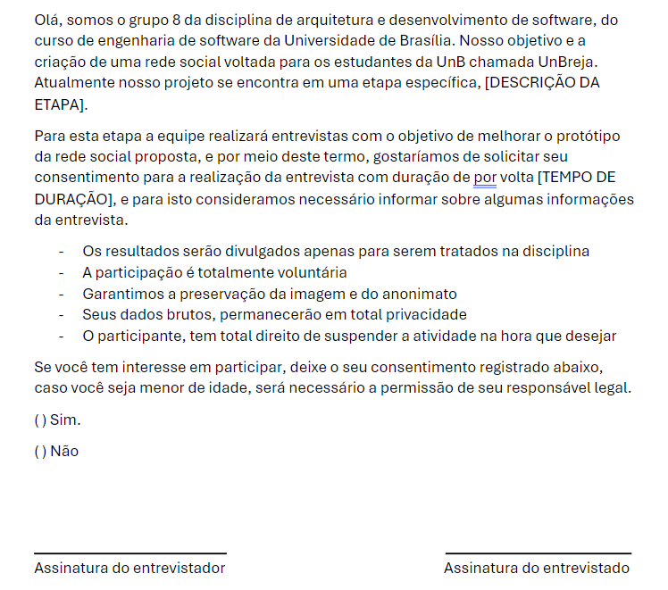

# Entrevista do Protótipo

## 1. Introdução

Neste artefato a equipe apresenta detalhes sobre as entrevistas realizadas em relação ao protótipo criado, confrome detalhado em[Protótipo](https://unbarqdsw2024-1.github.io/2024.1_G8_UnBreja/#/Base/1.4.6.prototipo). Além disso, é apresentada uma análise dos resultados obtidos a partir das entrevistas.

## 2. Termo de Consentimento

A participação na pesquisa ocorre com o consentimento livre e esclarecido dos participantes. O termo de consentimento garante que os participantes estejam plenamente informados sobre a pesquisa, assegurando uma decisão consciente sobre sua participação. Por exemplo, se gravações de voz ou imagem forem necessárias, a permissão para gravar deve ser explicitamente obtida. É fundamental enfatizar que os participantes têm o direito de recusar ou retirar seu consentimento em qualquer fase da pesquisa. Para assegurar a conformidade com esses princípios, o grupo utiliza o termo de consentimento ilustrado na Figura 1 quando necessário:

 <b> Figura 1 </b> - Termo de consentimento 

 

## 3. Metodologia

Para conduzir as entrevistas, utilizamos o framework DECIDE<a id="anchor_1" href="#REF1">¹</a>. Este framework abrange seis etapas fundamentais:

<b>Tabela 1:</b> Definição do DECIDE

| Letra | Descrição                                            |
| ----- | ---------------------------------------------------- |
| D     | Determinar os objetivos da avaliação.                |
| E     | Explorar perguntas a serem respondidas com a avaliação.|
| C     | Escolher os métodos de avaliação a serem utilizados. |
| I     | Identificar e administrar as questões práticas da avaliação. |
| D     | Decidir como lidar com as questões éticas.           |
| E     | Avaliar, interpretar e apresentar os dados           |

Além disto, o perfil de usuário das entrevistas será o de estudantes universitarios de 18 a 28 anos 

### 3.1. Descrição Detalhada dos Tópicos DECIDE

Para cada etapa do DECIDE, a equipe executou as seguintes ações:

1. **Determinar os Objetivos da Avaliação:** Definimos que o principal objetivo era avaliar a usabilidade e a eficiência do protótipo.
2. **Explorar Perguntas a Serem Respondidas:** Identificamos questões chave que abordavam a experiência do usuário e possíveis problemas no protótipo.
3. **Escolher Métodos de Avaliação:** Optamos por entrevistas semi-estruturadas para obter feedback detalhado e respostas abertas.
4. **Identificar e Administrar Questões Práticas:** Garantimos que todas as entrevistas fossem realizadas dentro do tempo planejado e que as ferramentas necessárias estivessem disponíveis.
5. **Decidir Como Lidar com Questões Éticas:** Obtivemos consentimento informado de todos os participantes, garantindo anonimato e confidencialidade.
6. **Avaliar, Interpretar e Apresentar os Dados:** Analisamos as respostas qualitativamente, destacando padrões e sugestões comuns.

### 3.2. Roteiro de perguntas

A tabela a seguir apresenta as perguntas a serem respondidas pelo usuário durante a entrevista

<b>Tabela 2:</b> Questionário pós testes de usabilidade

|Número da pergunta| Enunciado da pergunta|Resposta|
|---|---|---|
| 1                  | Foi identificado algum problema de usabilidade?                              | Aberta                   |
| 2                  | A disposição dos elementos na tela facilitou ou dificultou a realização da tarefa? | Aberta                   |
| 3                  | Foi experienciada alguma dificuldade de entendimento do protótipo?                 | Aberta                   |
| 4                  | Foi observada alguma sugestão de melhoria para o protótipo proposto?               | Aberta                   |

## 4. Análise de resultados

Após a realização das entrevistas, os feedbacks indicaram uma aceitação geral positiva em relação ao protótipo. Os participantes elogiaram o layout e o design dos elementos. No entanto, algumas sugestões de melhoria foram destacadas, especialmente na apresentação dos dados dos usuários. Especificamente, um entrevistado sugeriu ajustes na navegação para tornar o protótipo mais intuitivo. Essas observações indicam áreas de aprimoramento que podem ser abordadas em iterações futuras do protótipo.

## 5. Referências bibliograficas

> <a id="REF1" href="#anchor_1">1.</a> BARBOSA, S. D. J.; SILVA, B. S. Interação Humano-Computador. Rio de Janeiro: Elsevier, 2011.

## 4. Controle de Versionamento

| Versão | Data da Alteração | Alteração                | Responsável                      | Revisor                              | Data de Revisão |
|--------|--------------------|--------------------------|----------------------------------|--------------------------------------|-----------------|
| 1.0    | 08/04/2024         | Criação do Artefato      | [Pablo Guilherme](https://github.com/PabloGJBS) | [Suzane Duarte](https://github.com/suzaneduarte) | 10/04/2024      |
| 1.1    | 12/04/2024         | Adição de Detalhes Metodológicos | [Pablo Guilherme](https://github.com/PabloGJBS), [Suzane Duarte](https://github.com/suzaneduarte) |  |   |