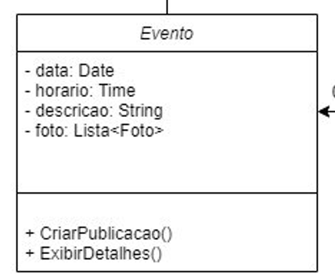

# 2.1.1.1. Diagrama de Classes 

## 1. Introdução

Esse artefato aborda um Diagrama de Classes, que nada mais é que um diagrama UML (representação gráfica de um modelo de sistema) estático que representa visualmente a estrutura de um sistema no que diz respeito a classes e interfaces, mostrando suas features, restrições e relacionamentos entre os elementos (FAKHROUTDINOV, 2017). 
</pp>

O Diagrama de Classes foi priorizado pela equipe na etapa de modelagem para fornecer uma representação visual clara da estrutura do sistema, facilitando o planejamento e design antes da implementação. Ele permite uma comunicação eficaz entre os membros da equipe, garantindo um entendimento compartilhado da arquitetura. Além disso, o diagrama serve como documentação valiosa para futuras referências, promove a reusabilidade e modularidade dos componentes, e simplifica a manutenção ao tornar mais fácil a compreensão da lógica e estrutura do sistema ao longo do tempo. Assim, esse diagrama serve de base para a criação de outros diagramas UML mais específicos.

<h3> 2. Detalhamento Metodológico </h3>

O diagrama de classes foi elaborado conforme a documentação e os padrões apresentados na linguagem de modelagem unificada (UML). Nesse sentido, os integrantes Ana Letícia e Artur Seppa se reuniram no Discord e utilizaram a ferramenta Draw.io para desenvolvimento em conjunto de forma online. Por fim, obteve-se a primeira versão do diagrama, que passou pela aprovação de todos os integrantes do grupo.

<h3> 2.1. Composição das classes</h3> 
O diagrama de classes padrão é composto de três partes:
<ul>
<li> Parte superior: contém o nome da classe.</li>
<li> Parte do meio: contém os atributos da classe.</li>
<li> Parte inferior: inclui as operações da classe (métodos)</li> 
</ul>

  <figure>
    <figcaption>Figura 1: Exemplo de classe. (Fonte: Artur Seppa e Ana Letícia, 2024)</figcaption>
  </figure>

<h3> 3. Diagrama de Classes </h3>

  <figure>
    <figcaption>Figura 2: Diagrama de Classes. (Fonte: Artur Seppa e Ana Letícia, 2024)</figcaption>
  </figure>

<h3> 3.1. Legenda</h3>
Por padrão utilizamos os seguintes elementos em nosso diagrama:

Figura 3 - Legenda Diagrama de Classes. Fonte: Projeto Mercado Livre, Grupo 2, 2023

<h3> 4. Conclusão </h3>

 

<h3> 5. Referências </h3>

> FAKHROUTDINOV, Kirill. UML Class and Object Diagrams Overview. In: FAKHROUTDINOV, Kirill. The Unified Modeling Language. [S. l.], 2017. Disponível em: https://www.uml-diagrams.org/uml-25-diagrams.html. Acesso em: 29 set. 2023.

> colocar o draw.io

> SERRANO, Milene. Diretrizes Organização dos Projetos. Disponível em: <https://aprender3.unb.br/course/view.php?id=19535>. Acesso em: 29 set. de 2023.

## 6. Histórico de versões

|    Data    | Versão |        Descrição        |                  Autor(es)                   | Data de revisão | Revisor(es) |
| :--------: | :----: | :---------------------: | :------------------------------------------: | :-------------: | :---------: |
| 08/07/2024 | `1.0`  | Criação do documento | [Artur Seppa Reiman](https://github.com/artur-seppa) |   [Suzane Duarte](https://github.com/suzaneduarte)               | 08/07/2024            |

