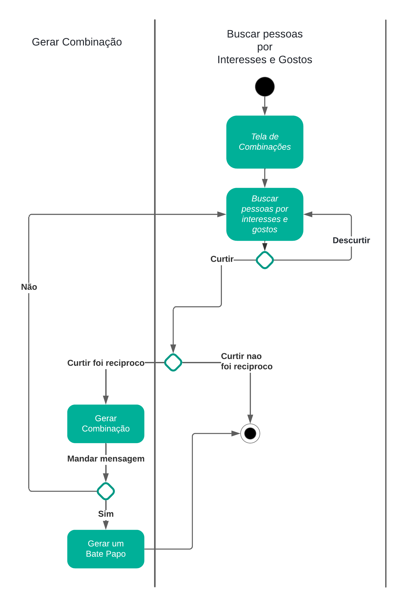
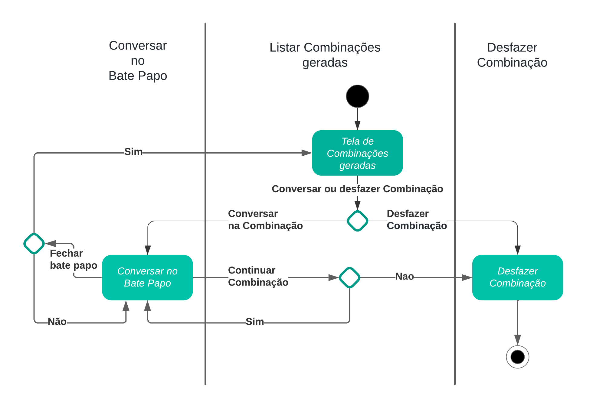

# Diagrama de Atividades

## 1. Introdução

O diagrama de atividades é um diagrama que representa o fluxo de trabalho de um sistema. Ele mostra o fluxo de um processo, incluindo atividades e ações executadas pelos componentes do sistema (humanos ou não). Ele oferece uma representação gráfica que facilita a compreensão das atividades, decisões, ramificações e paralelismos dentro do processo modelado. Essa visualização detalhada não apenas ajuda na análise e na identificação de melhorias, mas também na comunicação eficaz entre stakeholders, permitindo uma visão abrangente e estruturada de como um sistema ou processo funciona na prática.

## 2. Metodologia

Tendo como base oque foi ministrado em aula sobre o Diagrama de Atividades, e a reunião dos alunos Augusto Duarte e Cleber Brant que foi feita no Discord, para discutir mais sobre o assunto, inicialmente pesquisamos sobre como era desenvolvido o diagrama de Atividades, e com base no nosso BPMN, conseguimos aplicar nossas funcionalidades no diagrama, onde conseguimos utilizar modelos bem claros para o entendimento do sistema, além disso, utilizamos alguns videos e livros externos para retirada de dúvidas.

## 3. Diagrama de Atividades
Em nossa análise, decidimos que era necessário o desenvolvimento de um diagrama para cada funcionalidade do sistema, utilizando nosso [BPMN](https://unbarqdsw2024-1.github.io/2024.1_G8_UnBreja/#/Base/1.4.5.bpmn) como base, e que nos resultou os seguintes diagramas: Diagrama de Produto, Diagrama de Combinação, Diagrama de Bate Papo e Diagrama de Notícias e eventos.

### 3.1. Diagrama Produto

A seguir, na figura 1, está representada o Diagrama de Produto: cadastro, login e manutenção de informações.

**Figura 1** - Diagrama de Atividade - Produto 

*Fonte: [Augusto Duarte](https://github.com/Augcamp) e [Cleber Brant](https://github.com/Cleberbrant). 2024.*

### 3.2. Diagrama Combinação

A seguir, na figura 2, está representada o Diagrama de Combinação.

**Figura 2** - Diagrama de Atividade - Combinação 

*Fonte: [Augusto Duarte](https://github.com/Augcamp) e [Cleber Brant](https://github.com/Cleberbrant). 2024.*

### 3.3. Diagrama Bate Papo

A seguir, na figura 3, está representada o Diagrama de Bate Papo.

**Figura 3** - Diagrama de Atividade - Bate Papo 

*Fonte: [Augusto Duarte](https://github.com/Augcamp) e [Cleber Brant](https://github.com/Cleberbrant). 2024.*

### 3.4. Diagrama Noticias e Eventos

A seguir, na figura 4, está representada o Diagrama de Noticias e Eventos.

**Figura 4** - Diagrama de Atividade - Noticias e Eventos 

*Fonte: [Augusto Duarte](https://github.com/Augcamp) e [Cleber Brant](https://github.com/Cleberbrant). 2024.*

## 4. Conclusão

O Diagrama de Atividades é muito parecido com BPMN e Fluxograma, alguns videos até falam que é como se fosse um fluxograma mais requintado, sendo feito em UML, e eles nos auxilia na modelagem de processos e fluxos de trabalho dentro de um sistema de software. Ele é útil em várias etapas do desenvolvimento de software, desde a análise de requisitos até a implementação e manutenção. E no nosso caso, fizemos para todas a funcionalidades do nosso sistema, deixando mais claro o funcionamento de todos os processos.

Durante as discussões, o membro Cleber Brant trouxe uma perspectiva mais técnica, 
focando na implementação e na lógica do sistema, enquanto o membro Augusto Duarte se concentrou 
na experiência do usuário e na clareza dos fluxos. Essa diversidade de opiniões 
permitiu criar um artefato mais robusto e completo, que reflete na qualidade da entrega.

## 5. Referências

> O que é diagrama de atividades UML?. Lucidchart, ano desconhecido. Disponível em: <https://www.lucidchart.com/pages/pt/o-que-e-diagrama-de-atividades-uml>. Acesso em: 08 jul. de 2024.

> Diagrama de Atividades no Modelo de Caso de Uso de Negócios. CIN, UFPE. Disponível em: <https://www.cin.ufpe.br/~gta/rup-vc/extend.bus_model/guidances/guidelines/activity_diagram_in_the_business_use-case_model_5862EB50.html>. Acesso em: 08 de jul. de 2024.

> O que é um Diagrama de Atividade UML - Introdução. Youtube. Dispovível em: <https://www.youtube.com/watch?v=_1vHj_j3zDY&ab_channel=B%C3%B3sonTreinamentos>. Acesso em: 08 de jul. de 2024.

## 6. Controle de Versionamento
|    Data    | Versão |      Descrição            |                  Autor(es)                   | Revisor(es) |
| :--------: | :----: | :-----------------------: | :------------------------------------------: | :---------: |
| 08/07/2024 |  1.0   | Adição introdução e Referencias bibliograficas | [Augusto Duarte](https://github.com/Augcamp)  | [Cleber Brant](https://github.com/Cleberbrant) |
| 08/07/2024 |  1.1   | Diagramas de atividade produto e match | [Augusto Duarte](https://github.com/Augcamp)  | [Cleber Brant](https://github.com/Cleberbrant) |
| 08/07/2024 |  1.2   | Adicionando metodologia e diagramas de chat e noticias/eventos | [Cleber Brant](https://github.com/Cleberbrant)  | [Augusto Duarte](https://github.com/Augcamp) |
| 08/07/2024 |  1.3   | Adicionado Conclusão e pequenos detalhes que faltavam | [Cleber Brant](https://github.com/Cleberbrant)  | [Augusto Duarte](https://github.com/Augcamp) |
| 08/07/2024 |  1.4   | Complementando metodologia | [Cleber Brant](https://github.com/Cleberbrant)  | [Pablo Guilherme](https://github.com/PabloGJBS) |
| 24/07/2024 |  1.5   | Tradução de termos da modelagem, mudança de alguns substantivos para verbos nos diagramas, adicionado raias e fases | [Cleber Brant](https://github.com/Cleberbrant)  | [Augusto Duarte](https://github.com/Augcamp) |
| 24/07/2024 |  1.6   | Adição do senso crítico e dicussão do trabalho em equipe | [Augusto Duarte](https://github.com/Augcamp)  | [Cleber Brant](https://github.com/Cleberbrant) |
