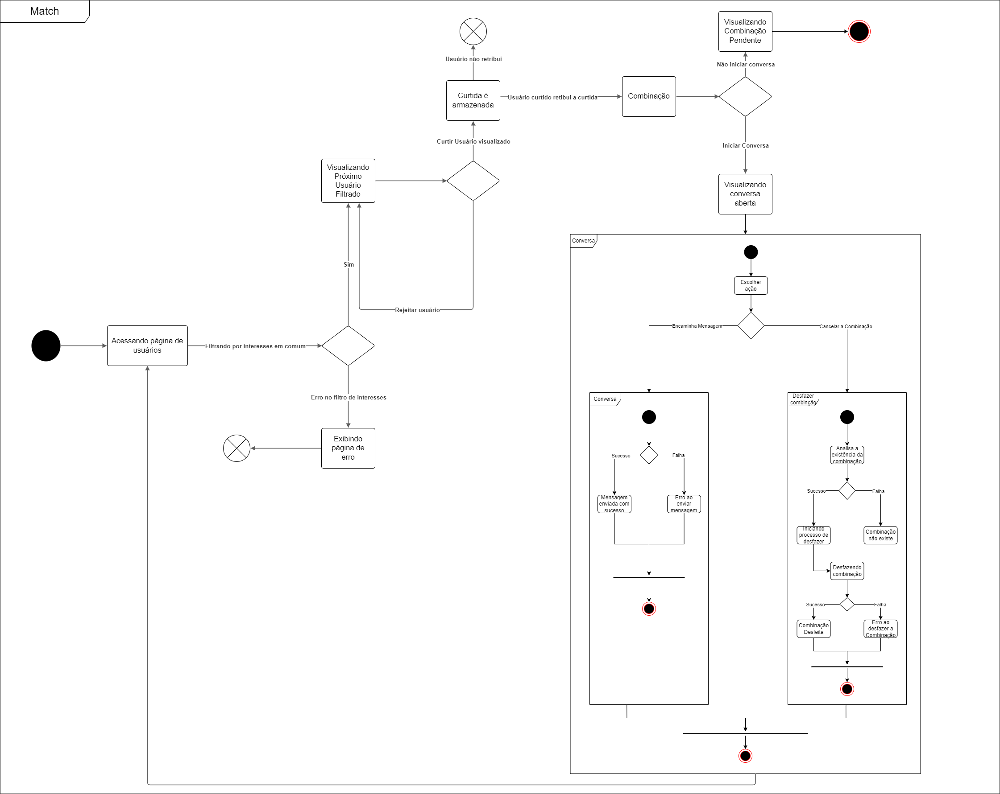

# Diagrama de Estados 

## 1. Introdução

O diagrama de estados UML é uma ferramenta poderosa utilizada para modelar o comportamento dinâmico de um sistema. É bastante útil para representar os estados pelos quais um objeto passa durante seu ciclo de vida, assim como as transições que ocorrem em resposta a eventos específicos.

Os estados no diagrama indicam as diferentes combinações de informações que um ou mais objetos pode conter, e não como ele se comporta. Os diferentes estados de um objeto pode ser entendido por meio da visualização de todos os possíveis estados e como o objeto pode chegar a determinado estado. É possível ser visto utilizando um diagrama de estados UML.

Diagramas de estados retratam principalmente estados e transições. Os estados são representados por retângulos e nomeados com o nome do estado. As transições são marcadas com as setas que saem de um estado para outro.

O Diagrama de Estado possuí diversos usos. As suas principais aplicações são as seguintes:

- Descrever objetos orientados a eventos em um sistema reativo.
- Ilustrar cenários de caso de uso em um contexto de negócios.
- Descrever como um objeto se move por vários estados em seu tempo vida.
- Mostrar o comportamento geral de uma máquina de estados ou o comportamento de um conjunto relacionado de máquinas de estados.

## 2. Metodologia

Utilizando como base o que foi ensinado dentro de sala de aula e com os materiais de estudo fornecidos, utilizamos a plataforma [Draw.io](https://app.diagrams.net/) para que possa nos auxiliar na criação do nosso diagrama. O processo envolveu diversas etapas, incluindo reuniões entre a equipe para discutir o funcionamento do projeto e a estruturação do BPMN. Cada membro da equipe contribuiu com suas perspectivas e conhecimentos específicos, o que foi fundamental para a elaboração de um diagrama de estados coerente e detalhado.

Primeiramente, identificamos os principais estados e transições relevantes para a funcionalidade de combinação (match) do nosso projeto. Em seguida, esboçamos um rascunho inicial do diagrama, que foi revisado e aprimorado com base no feedback dos membros da equipe. Esse processo iterativo garantiu que o diagrama final refletisse com precisão os estados e transições do sistema.

## 3. Diagrama de Estados

Utilizando como base as reuniões que realizamos acerca sobre o funcionamento do nosso projeto e a forma como foi estruturado nosso BPMN, achamos que seria necessário a criação do Diagrama de Estados para que possamos ter uma melhor visualização dos objetos de nosso projeto e os seus estados ao longo de cada transição. Dessa forma, com a análise feita, foi realizado o diagrama da funcionalidade de Match como pode ver logo abaixo:

### 3.1. Diagrama Combinação (Match)

A figura a seguir representa o Diagrama de Estados acerca da funcionalidade de Combinação (Match) do nosso projeto.

*Fonte: [Luana Torres](https://github.com/luanatorress) e [Wesley Lira](https://github.com/Weslin-0101). 2024*

### 3.2 Pseudoestados de Início e Fim

Para garantir que o fluxo geral tenha um ponto de término claro, foi adicionado um pseudoestado de fim fora do subfluxo de 'conversa'. Este ajuste assegura que, independentemente do caminho seguido pelo usuário, o fluxo culmina em um ponto final definido. Assim, o diagrama reflete de maneira mais precisa o ciclo de vida completo das interações no sistema, em que, após o término do subfluxo de conversa, migra novamente para a visualização da página de usuários. Assim, o fim do fluxo geral está centrado quando o usuário decide não iniciar uma conversa. 

## 4. Conclusão

O diagrama de estados é particularmente útil em sistema onde o comportamento é complexo e fortemente baseado em estados, como em sistema embarcados, controladores de processos e interfaces de usuário. Permite uma visualização clara de como um objeto reage a diferentes eventos ao longo do tempo, facilitando a análise e o desenvolvimento de sistemas robustos e bem definidos.

A criação do diagrama de estados para a funcionalidade de Combinação (Match) do nosso projeto proporcionou diversos aprendizados centrados na modelagem de sistemas de software. Durante o processo de elaboração, percebemos a importância de mapear meticulosamente cada estado e transição, garantindo que todas as possíveis interações dos usuários fossem contempladas. A criação deste artefato revelou algumas complexidades que não eram evidentes em outros tipos de diagramas, como o BPMN, utilizado anteriormente.

Através deste, foi possível visualizar com clareza os estados do sistema pois, o diagrama facilitou a compreensão de como os objetos se comportam em diferentes situações, permitindo identificar rapidamente os estados e transições mais críticos. Outro ponto positivo foi que o diagrama serviu como uma ferramenta de comunicação eficaz entre os membros da equipe, garantindo que todos tivessem uma visão compartilhada do comportamento do sistema.

Algumas das dificuldades enfrentadas durante a diagramação foi a integração do diagrama de estados com outros diagramas, como o de atividades e o de sequência para fornecer uma visão mais completa do sistema.

Em suma, o processo de criação deste diagrama destacou a importância da colaboração e da comunicação efetiva dentro da equipe. Cada membro trouxe uma perspectiva única, enriquecendo o resultado final, mostrando-se uma ferramenta poderosa para compreensão do sistema e seus estados. O diagrama erviu como uma ferramenta crucial para tornar o design e a implementação do projeto mais eficiente deixando mais claro os próximos passos a seguir. 

## 5. Referências

> O que é um diagrama de máquina de estados?. Lucidchart. Disponível em: <https://www.lucidchart.com/pages/pt/o-que-e-diagrama-de-maquina-de-estados-uml>. Acesso em: 08 de jul. de 2024

> Introdução ao Diagrama de Máquina de Estados UML. Youtube. Disponível em: <https://www.youtube.com/watch?v=N0wc9sHp5yo>. Acesso em: 07 de jul. de 2024

## 6. Controle de Versionamento

| Data       | Versão | Descrição                                                   | Autor(es)                                       | Data de revisão | Revisor(es)                                             |
| ---------- | ------ | ----------------------------------------------------------- | ----------------------------------------------- | --------------- | ------------------------------------------------------- |
| 08/07/2024 | 1.0    | Adicionado Introdução, Metodologia, Conclusão e referência. | [Wesley Lira](https://github.com/Weslin-0101)   | 08/07/2024      | [Eduardo Rodrigues](https://github.com/Eduardo-RFarias) |
| 08/07/2024 | 1.1    | Adicionando o Diagrama de Estados                           | [Luana Torres](https://github.com/luanatorress) | 08/07/2024      | [Eduardo Rodrigues](https://github.com/Eduardo-RFarias) |
| 08/07/2024 | 1.2    | Corrigindo tabela de versionamento                          | [Luana Torres](https://github.com/luanatorress) | 08/07/2024      | [Suzane Duarte](https://github.com/suzaneduarte)        |
| 08/07/2024 | 2.0    | Explanação da metodologia, adição da análise crítica na conclusão e modificação do diagrama, adicionando um fim de fluxo geral explicado na nova sessão 3.2  | [Luana Torres](https://github.com/luanatorress) | 24/07/2024      | [Wesley Lira](https://github.com/Weslin-0101)      |