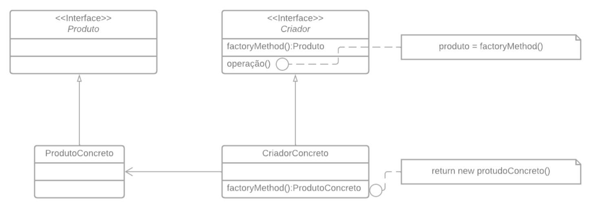

# Módulo Padrões de Projeto GoF(s) Criacionais

## 1. Introdução

Os padrões de projeto GoF (Gang of Four) fornecem uma base, modelo ou descrição através de abordagens reutilizáveis e orientadas a objetos para resolver problemas recorrentes no desenvolvimento de software.Isto é, eles permitem evidenciar os aspectos essenciais de problemas comuns, levando a uma compreensão mais ampla e orientada à construção de sistemas que exibam efetivamente as qualidades desejadas.

No caso dos padrões de projeto Criacionais, eles "abstraem o processo de instanciação e ajudam a tornar um sistema independente de como seus objetos são criados, compostos e representados" (GAMMA et al., 1994, p. 81).

À medida que os sistemas evoluem, tornam-se mais dependentes da composição de objetos do que da herança de classes. Nesse contexto, os padrões de criação ganham importância, deslocando a ênfase da codificação rígida de um conjunto fixo de comportamentos para a definição de um conjunto menor de comportamentos fundamentais, que podem ser compostos de várias formas para criar comportamentos mais complexos. Assim, criar objetos com comportamentos específicos exige mais do que simplesmente instanciar uma classe.

## 2. Metodologia

A priori foi elaborada uma divisão da equipe para que todos consigam discutir, elaborar, desenvolver e revisar diferentes partes do documento. A partir disso, foram dividos quatro principais responsáveis por levar à frente da modelagem e implementação do(s) GoF(s). A seguir, são definidos os **Revisores Principais** (responsáveis por cobrar a elaboração do GoF à equipe responsável e revisar a respectiva modelagem) e **Revisores Secundários** (responsáveis por revisar a implementação e demais pendências, como alterações no template da documentação).

| Nome | Contribuição |
|:----:|:------------:|
|[Ana Letícia](https://github.com/analeticiaa) | Desenvolvimento do GoF Criacional |
|[Suzane Duarte](https://github.com/suzaneduarte) | Desenvolvimento do GoF Criacional |
|[João Pedro Anacleto](https://github.com/jpanacleto2)| Desenvolvimento do GoF Criacional | 
|[Cleber Brant](https://github.com/CleberBrant) | Desenvolvimento do GoF Criacional |
|[Pablo Guilherme](https://github.com/PabloGJBS) | Revisor Principal |
|[Luana Torres](https://github.com/luanatorress) | Revisor Principal |
|[Wesley Lira](https://github.com/Weslin-0101) | Revisor Principal | 
|[Augusto Duarte](https://github.com/Augcamp)  | Revisor Principal |
|[Eduardo Rodrigues](https://github.com/Eduardo-RFarias) | Revisor Secundário |
|[Edilberto Cantuaria](https://github.com/edilbertocantuaria) | Revisor Secundário |
|[Matheus Silverio](https://github.com/MattSilverio) | Revisor Secundário | 
|[Artur Seppa](https://github.com/artur-seppa) | Revisor Secundário |

A partir disso, também foi realizado uma reunião via ferramenta Discord, onde foi definido entre os membros presentes os padrões mais adequados para o projeto. 

## 3. Padrão de Projeto Criacional - Factory Method 

### 3.1. Base

O Factory Method define uma interface para criar um objeto, mas deixa as subclasses decidirem qual classe instanciar. O Factory Method permite que uma classe delegue a responsabilidade de instanciação às subclasses.

Isto é, existe uma classe que possui um método que pode ou não ser abstrato. Se ele for, força-se as subclasses a implementarem esse método informando o tipo de produto que irá ser retornado.

A seguir, é apresentado uma Estrutura do padrão Factory Method.

  <figure>
    <figcaption>
      
Figura 1: Estrutura do Factory Method. Fonte: <a href="https://unbarqdsw2022-1.github.io/2022.1_G2_DonAct/#/">Projeto Donact</a>, Grupo 2, 2022.1.

    </figcaption>
  </figure>

Nesse contexto, os participantes são: 

- **Product**: define atributos e métodos (programados de forma mais genérica, para um conjunto de objetos), de forma que haja uma interface comum para todos os objetos criados pelo factory method;

- **ConcreteProduct**: estende Product, especializando o que foi definido na superclasse e implementando a interface do produto; de forma que a instância deste objeto é retornada pela classe específica ConcreteCreator.

- **Creator**: declara o factory method, o qual retorna um objeto do “tipo” Product. Essa classe também pode definir uma implementação default do factory method que retorna um objeto ConcreteProduct default, podendo ainda chamar um factory method para criar um objeto de Product.

- **ConcreteCreator**: sobrescreve o factory method para retornar uma instância de ConcreteProduct. De forma que o factory method não precisa criar uma nova instância de produto todas as vezes, por exemplo, uma instância do objeto pode ser armazenada no cache e retornada posteriormente ao chamar o factory method.

Em suma, tais padrões do Factory Methods, eliminam a necessidade de anexar classes específicas das aplicações no código, de forma que ele somente lida com a interface de Product; portanto, ele pode trabalhar com quaisquer classes ConcreteProduct definidas pelo usuário.

### 3.2. Modelagem

  <figure>
    <figcaption>Figura 2: Modelagem do Factory Method aplicada ao projeto. Fonte: <a href="https://github.com/jpanacleto2">João Pedro Anacleto</a>, <a href="https://github.com/suzaneduarte">Suzane Duarte</a>.</figcaption>
  </figure>

### 3.3. Implementação do Factory Method
    
    public abstract class Usuario {
        protected String nomeUsuario;
        protected String nomeCompleto;
        protected String email;
        protected String senha;
        protected Date dtNascimento;
        protected String telefone;
        protected List<Foto> fotos;
    
        public abstract void cadastrar();
        public abstract void deletar();
        public abstract void atualizar();
        public abstract void ler();
    }

    public class UsuarioConcretaComum extends Usuario {
        private ObjetivoUsuario objetivo;
        private String descricao;
        private String redeSocial;
        private Universidade universidade;
        private List<Interesse> interesses;
    
        @Override
        public void cadastrar() {
            // Implementação específica para UsuarioConcretaComum
        }
    
        @Override
        public void deletar() {
            // Implementação específica para UsuarioConcretaComum
        }
    
        @Override
        public void atualizar() {
            // Implementação específica para UsuarioConcretaComum
        }
    
        @Override
        public void ler() {
            // Implementação específica para UsuarioConcretaComum
        }
    }

    public class UsuarioConcretaAdministrador extends Usuario {
        private String perfil;
    
        @Override
        public void cadastrar() {
            // Implementação específica para UsuarioConcretaAdministrador
        }
    
        @Override
        public void deletar() {
            // Implementação específica para UsuarioConcretaAdministrador
        }
    
        @Override
        public void atualizar() {
            // Implementação específica para UsuarioConcretaAdministrador
        }
    
        @Override
        public void ler() {
            // Implementação específica para UsuarioConcretaAdministrador
        }
    }

    public abstract class Evento {
        protected Date data;
        protected Time horario;
        protected String descricao;
        protected List<Foto> fotos;
    
        public abstract void criarPublicacao();
        public abstract void exibirDetalhes();
    }
    

    public class EventoConcretaSocial extends Evento {
        private String endereco;
        private String tipo;
    
        @Override
        public void criarPublicacao() {
            // Implementação específica para EventoConcretaSocial
        }
    
        @Override
        public void exibirDetalhes() {
            // Implementação específica para EventoConcretaSocial
        }
    }
    
    public class EventoConcretaAcademico extends Evento {
        private String palestrante;
        private String tema;
        private String sala;
    
        @Override
        public void criarPublicacao() {
            // Implementação específica para EventoConcretaAcademico
        }
    
        @Override
        public void exibirDetalhes() {
            // Implementação específica para EventoConcretaAcademico
        }
    }

    public class UsuarioFactory {
        public static Usuario criarUsuario(String tipoUsuario) {
            switch (tipoUsuario.toLowerCase()) {
                case "comum":
                    return new UsuarioConcretaComum();
                case "administrador":
                    return new UsuarioConcretaAdministrador();
                default:
                    throw new IllegalArgumentException("Tipo de usuário desconhecido.");
            }
        }
    }

    public class EventoFactory {
        public static Evento criarEvento(String tipoEvento) {
            switch (tipoEvento.toLowerCase()) {
                case "social":
                    return new EventoConcretaSocial();
                case "academico":
                    return new EventoConcretaAcademico();
                default:
                    throw new IllegalArgumentException("Tipo de evento desconhecido.");
            }
        }
    }

## 4. Padrão de Projeto Criacional - Método Builder

### 4.1. Base

O Builder é um padrão de projeto criacional que nos permite construir objetos complexos passo a passo. Nesse padrão, podemos produzir diferentes tipos e representações de um objeto usando o mesmo código de construção.

O padrão Builder sugere que você extraia o código de construção do objeto para fora de sua própria classe e mova ele para objetos separados chamados builders. “Builder” significa “construtor”, mas por padrão não usamos essa palavra para evitar confusão com os construtores de classe.

A Figura 3 apresenta a estrutura de um Builder.

  <figure>
    <figcaption>Figura 3: Estrutura do padrão Builder. Fonte: Refactoring Guru </figcaption>
  </figure>

Onde, 
- A interface Builder declara etapas de construção do produto que são comuns a todos os tipos de builders.
- Builders Concretos provém diferentes implementações das etapas de construção. Builders concretos podem produzir produtos que não seguem a interface comum.
- Produtos são os objetos resultantes. Produtos construídos por diferentes builders não precisam pertencer a mesma interface ou hierarquia da classe.
- A classe Diretor define a ordem na qual as etapas de construção são chamadas, então você pode criar e reutilizar configurações específicas de produtos.
- O Cliente deve associar um dos objetos builders com o diretor. Usualmente isso é feito apenas uma vez, através de parâmetros do construtor do diretor. O diretor então usa aquele objeto builder para todas as futuras construções. Contudo, há uma abordagem alternativa para quando o cliente passa o objeto builder ao método de produção do diretor. Nesse caso, você pode usar um builder diferente a cada vez que você produzir alguma coisa com o diretor.

### 4.2. Vantagens e Desvantagens 

Ao utilizar o padrão Builder existem algumas vantagens e desvantagens. 
Podemos citar como vantagens:
1. Você pode construir objetos passo a passo, adiar as etapas de construção ou rodar etapas recursivamente.
2. Você pode reutilizar o mesmo código de construção quando construindo várias representações de produtos.
3. Princípio de responsabilidade única. Você pode isolar um código de construção complexo da lógica de negócio do produto.

E como desvantagem:
1. A complexidade geral do código aumenta uma vez que o padrão exige criar múltiplas classes novas.
   
### 4.3. Modelagem

  <figure>
    <figcaption>Figura 4: Builder. Fonte: Ana Letícia e Cleber. </figcaption>
  </figure>

### 4.4. Implementação do Builder

    // Classes Comum e Administrador
    class Comum {
        //Classe comum
    }

    class Administrador {
    //Classe Administrador
    }

    // Interface Builder
    interface Builder {
        void cadastrar();
        void deletar();
        void atualizar();
        void ler();
    }

    // Concrete Builder Comum
    class ConcreteBuilderComum implements Builder {
        private Comum comum;

        public ConcreteBuilderComum() {
            this.reset();
        }

        private void reset() {
            this.comum = new Comum();
        }

        @Override
        public void cadastrar() {
            // Implementação do cadastro
        }

        @Override
        public void deletar() {
            // Implementação da deleção
        }

        @Override
        public void atualizar() {
            // Implementação da atualização
        }

        @Override
        public void ler() {
            // Implementação da leitura
        }

        public Comum getResult() {
            Comum product = this.comum;
            this.reset();
            return product;
        }
    }

    // Concrete Builder Administrador
    class ConcreteBuilderAdministrador implements Builder {
        private Administrador administrador;

        public ConcreteBuilderAdministrador() {
            this.reset();
        }

        private void reset() {
            this.administrador = new Administrador();
        }

        @Override
        public void cadastrar() {
            // Implementação do cadastro
        }

        @Override
        public void deletar() {
            // Implementação da deleção
        }

        @Override
        public void atualizar() {
            // Implementação da atualização
        }

        @Override
        public void ler() {
            // Implementação da leitura
        }

        @Override
        public void ler() {
            // Implementação da leitura
        }

        @Override
        public void criarPublicacao() {
            // Implementação da Criar Publicacao
        }

        @Override
        public void exibirDetables() {
            // Implementação da Exibir Detalhes
        }

        public Administrador getResult() {
            Administrador product = this.administrador;
            this.reset();
            return product;
        }
    }

    // Classe Director
    class Director {
        private Builder builder;

        public void setBuilder(Builder builder) {
            this.builder = builder;
        }

        public void makeConcreteBuilderComum(Builder builder) {
            builder.cadastrar();
            builder.deletar();
            builder.atualizar();
            builder.ler();
        }

        public void makeConcreteBuilderAdministrador(Builder builder) {
            builder.cadastrar();
            builder.deletar();
            builder.atualizar();
            builder.ler();
            builder.criarPublicacao();
            builder.exibirDetables();
        }
    }

    // Classe Application
    public class Application {
        public static void main(String[] args) {
            Director director = new Director();

            // Construindo Comum
            ConcreteBuilderComum builderComum = new ConcreteBuilderComum();
            director.setBuilder(builderComum);
            director.makeConcreteBuilderComum(builderComum);
            Comum comum = builderComum.getResult();

            // Construindo Administrador
            ConcreteBuilderAdministrador builderAdministrador = new ConcreteBuilderAdministrador();
            director.setBuilder(builderAdministrador);
            director.makeConcreteBuilderAdministrador(builderAdministrador);
            Administrador administrador = builderAdministrador.getResult();

            // Demonstrando uso
            System.out.println("Comum e Administrador foram construídos com sucesso.");
        }
    }

## 6. Conclusão

Conforme foi apresentado nas seções anteriores, a utilização de Padrões de Projeto no desenvolvimento de aplicações aumenta a flexibilidade do sistema, sua manutenibilidade e a legibilidade do código, que passa a ser distribuído por módulos menores. De forma que, tais benefícios levam diretamente à diminuição da complexidade do código por torná-lo mais modular e organizado, o que reduz diretamente sua complexidade.

A partir disso, os membros responsáveis pelo desenvolvimento do GoF Criacional realizaram discussões para definir qual o padrão criacional mais adequado para a aplicação, buscando compreender as principais características e vantagens de cada um deles.

Chegou-se a conclusão de que os padrões de projetos criacionais mais adequados a serem utilizados foram:

Factory Method e o Método Builder.

Ambos os padrões são valiosos no arsenal de design de software, oferecendo soluções elegantes para desafios comuns na criação de objetos. O Factory Method é eficaz para sistemas que precisam criar diferentes tipos de produtos a partir de uma interface comum, enquanto o Builder é ideal para cenários onde a construção de objetos complexos precisa ser feita de maneira controlada e modular.
## Colaboração e Trabalho em Equipe

## Referências

> GAMMA, Erich; HELM, Richard; JOHNSON, Ralph; VLISSIDES, John. Design Patterns: Elements of Reusable Object-Oriented Software. Boston: Addison-Wesley, 1994. Disponível em: <https://www.javier8a.com/itc/bd1/articulo.pdf>. Acesso em: 23 jul. de 2024.

> Projeto Donact, Grupo 2, 2022.1. GitHub.[https://unbarqdsw2022-1.github.io/2022.1_G2_DonAct/#/](https://unbarqdsw2022-1.github.io/2022.1_G2_DonAct/#/)

> Padrao Builder, Refactoring Guru.[https://refactoring.guru/pt-br/design-patterns/builder](https://refactoring.guru/pt-br/design-patterns/builder)

## Controle de Versionamento

| Versão | Data da alteração |      Alteração      |     Responsável     |                     Revisor                      | Data de revisão |
| :----: | :---------------: | :-----------------: | :-----------------: | :----------------------------------------------: | :-------------: |
|  1.0   |    18/07/2024     | Criação do template do artefato | [Suzane Duarte](https://github.com/suzaneduarte) | [Pablo Guilherme](https://github.com/PabloGJBS) |    22/07/2024    |
|  1.1   |    23/07/07/2024     | Adiciona 1.Introdução e 3.1.Base | [Suzane Duarte](https://github.com/suzaneduarte) | [Augusto Duarte](https://github.com/Augcamp) |     23/07/2024  |
|1.2|   24/07/2024  |  Revisão do texto e correções gramaticais. |  [Pablo Guilherme](https://github.com/PabloGJBS) | - |  - |
|1.3|   24/07/2024  |  Adição da modelagem e da implementação no codigo. |  [João Pedro Anacleto](https://github.com/jpanacleto2) | [Wesley Lira](https://github.com/Weslin-0101) |  24/07/2024 |
|1.4|   24/07/2024  |  Adicionando referências e alterando Figura 1 |  [Suzane Duarte](https://github.com/suzaneduarte) | [João Pedro Anacleto](https://github.com/jpanacleto2) |  24/07/2024 |
|1.5|   24/07/2024  |  Adiciona texto e modelagem sobre Builder. |  [Ana Letícia](https://github.com/analeticiaa) | - |  - |
|1.6|   24/07/2024  |  Adiciona codigo do builder e referencia. |  [Cleber Brant](https://github.com/Cleberbrant) | - |  - |
|1.7|   24/07/2024  |  Revisão do artefato e solicitação da seção "colaboração e trabalho em equipe"  |  [Luana Torres](https://github.com/luanatorress) | [Ana Letícia](https://github.com/analeticiaa)  |   24/07/2024| 